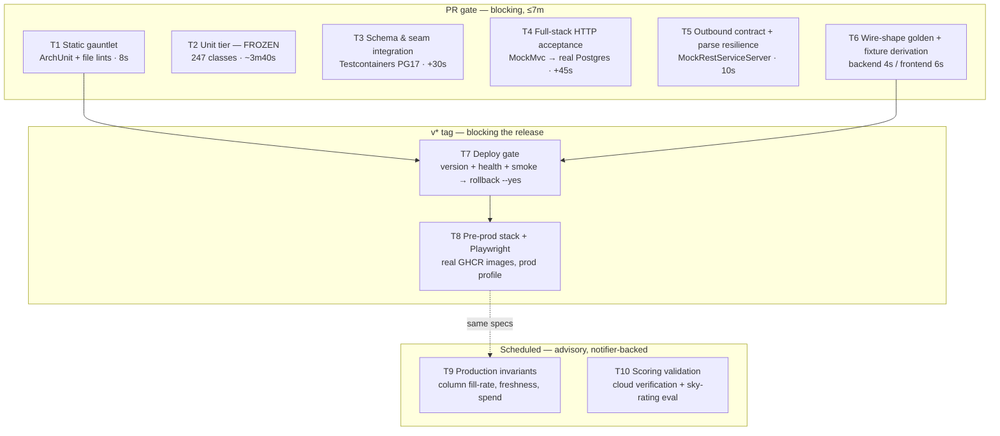

# Integration & UI Test Strategy

*Golden Hour — July 2026. Supersedes the three draft proposals and their red-team dossiers.*

**Verification note.** Several load-bearing claims in the proposals are false against the current tree. I checked each one before writing. The corrections are called out inline, but the three that change the plan most:

- **Rollback already exists and is good.** `scripts/rollback.sh` (digest-pinned, `--single-transaction` restore, safety dump first, compose-override pin) and `scripts/pre-release-backup.sh` (dump + image digests + schema version, aborts the release on failure) are both in the tree and both wired into `deploy.yml`. All three proposals said "there is no rollback anywhere in the repo". Wrong. What is missing is *anything that decides to call it*.
- **The failure notifier is already wired into six of ten workflows** — `deploy.yml`, `codeql.yml`, `pitest.yml`, `zap.yml`, `security-scan.yml`, `backup-verify.yml` (`grep -ln ci-failure-issue .github/workflows/*.yml`). Only `real-api-smoke.yml` still lacks it. The recon's "four of six scheduled workflows have no notifier" is stale.
- **`GET /api/status` does not exist.** `StatusController` declares exactly one mapping: `@GetMapping(path = "/stream")` at line 103. Three tiers across two proposals built their deploy verification on it. The version lives only behind `@PreAuthorize("hasRole('ADMIN')")` on `AdminBuildInfoController` (`/api/admin/build-info`) and in `/actuator/health` details, which prod gates with `show-details: when_authorized`.

---

## 1. Where we actually are

### The estate, by layer

| Layer | Count | What it runs against | Verified how |
|---|---|---|---|
| Mockito / plain-JUnit unit classes | 247 | Every collaborator mocked | recon inventory, filtered to surefire include patterns |
| Controller classes on `AbstractControllerTest` | 36 | Real `SecurityFilterChain`, real Jackson, **56 `@MockitoBean`s** underneath | `grep -rl "extends AbstractControllerTest"` → 36; `grep -c "@MockitoBean"` → 56 |
| `@DataJpaTest` repository slices | 8 (of 40 repositories) | H2, entity-generated schema | `ls src/test/.../repository/` → 8; `ls src/main/.../repository/` → 40 |
| `IntegrationTestBase` subclasses | **5** (+1 env-gated real-API) | **Testcontainers postgres:17-alpine, Flyway on, `ddl-auto=validate`, WireMock Anthropic** | `grep -l "extends IntegrationTestBase" integration/*.java` |
| Real-socket tests (`RANDOM_PORT`) | **0** | — | `grep -rn webEnvironment` → nothing |
| Outbound-URL assertions (`MockRestServiceServer`) | **2** | Pushover, AuroraWeatherEnricher | `grep -rl MockRestServiceServer` → 3 files, one is the caveat doc |
| Frontend vitest files | 82 (~1819 tests) | **Every `api/` module `vi.mock`ed** | `find src -name '*.test.js*'` → 82 |
| Playwright specs | 1 file, 10 tests | Nothing — runs in no workflow, browser binary stale | `ls src/test/e2e/` |

`backend/src/test/resources/application.yml` sets `spring.flyway.enabled: false` and `ddl-auto: create-drop`. So **125 migrations execute in exactly 5 test classes**, and those 5 run inside the *default* surefire run on `ubuntu-latest` — no failsafe, no profile, no Docker guard.

### The gap, precisely

The estate is an hourglass with a strong HTTP band and no waist. Three specific holes:

1. **Nothing asserts what a write path wrote.** The 5 integration classes assert row *existence*. The dominant production failure was a row that existed with a null column (`upwind_sample`, `inversion_potential` at 3 non-null in 21,696 rows).
2. **Nothing builds an outbound URL.** `backend/src/test/java/com/gregochr/goldenhour/util/RestClientMocks.java:35-37` says so in its own Javadoc. `OpenMeteoClientTest` mocks the `@HttpExchange` interfaces, so `HttpServiceProxyFactory`'s param binding never executes.
3. **Nothing crosses the language boundary.** A coordinated rename of `fierySkyPotential` across all 16 referencing frontend files left 1819/1819 green (proven by mutation in recon). `apparentTemperatureCelsius` has zero backend `jsonPath` pins *and* a `?? temperatureCelsius` fallback at `MarkerPopupContent.jsx:520,957,988` — a rename silently displays air temperature as feels-like.

### The escaped-defect histogram — the evidence base

~37 distinct escaped defects, from 505 `fix:` commits and ~35 investigation docs:

```
Wiring / cross-component seam        ████████ 8
External API / SDK contract drift    ████████ 8
Cache coherence & staleness          ██████ 6
Product-semantic honesty             ██████ 6
CI / verification self-failure       █████ 5
Scheduler / background silent death  ████ 4
Config / profile / runtime env       ████ 4
Frontend session / token lifecycle   ████ 4
Clock / timezone                     ████ 4 (1 prod, 3 CI flakes)
Schema / migration / index           ███ 3 clusters
Concurrency / transaction boundary   ██ 2
```

Almost none was "a function computed the wrong number" — the tier 247 unit classes and a JaCoCo 80% gate already cover. The dominant signature is **silence**: no exception, no log line, zero rows. `grep -c silent CHANGELOG.md` → 25+.

Detection was almost never a test. It was a human running SQL against prod (`forecast_run_disposition` count zero; `inversion_potential` 3 of 21,696; `pipeline_run_pick` empty since run #21), `launchctl list` (backups dead 132 nights), or an adversarial review of something unrelated.

---

## 2. The shape we're aiming for

**Target: a T — a broad mechanical base, one narrow column of composition tests, and a data-shaped roof.**

Not a triangle. A triangle optimises for a world where most defects are logic bugs inside units. Here 8 of 37 were seam wiring, 8 were external-contract drift, 6 were cache/reader coherence, 6 were absence-rendered-as-negative. All mid-tier or higher by nature, and none of them detectable by adding a 248th mock test.

Not a diamond either, and this is the adjudication against Uncle Bob's proposal. A diamond is still a shape made of hand-authored assertions, so it inherits the blind spot that produced the defects: composition tests catch the seams you thought about. The two tiers that scale *without* someone anticipating the defect are **static rules** (they hold over code not yet written) and **production data probes** (they observe what actually happened). Those get the weight.

The horizontal bar is static rules + contract pinning + data probes. The vertical column is a deliberately small set of full-stack tests over the auth perimeter and the write paths. Everything else is frozen.



**One deliberate asymmetry.** The frontend gets a contract tier and no coverage gate. Its 1819 tests are a render-layer net that survived three API base URLs being rewritten to nonsense. More of them buys nothing; pinning the wire buys everything.

---

## 3. The tiers

### T0 — Gate hygiene (not a test tier; do it first)

**Protects:** the credibility of everything below. **Blocking:** n/a. **Budget:** −38s on the PR gate, ~3 hours to implement.

Four changes, each verified against the tree:

1. **Delete `.github/workflows/ci.yml` lines 34-36.** `backend/pom.xml:370-397` binds `spotbugs:check` to the `verify` phase with `findsecbugs-plugin:1.14.0` in the plugin configuration. `mvn clean verify` has already run the identical analysis. The step re-runs checkstyle + `jacoco:prepare-agent` + `spotbugs:spotbugs` for a second 34s (job-log timestamps 10:34:33 → 10:35:11).
2. **Wire `notify-failure` into `real-api-smoke.yml`** — the one remaining workflow without it.
3. **Do *not* set `parseSurefireConfig=true`.** Both the pragmatist and the SRE proposal recommended this. Verified wrong: `pom.xml:594-601` excludes `controller.*`, `*IntegrationTest`, `*IT` and `LocationFailureTrackingUIDemo`, none of which carries a JUnit tag. Surefire's `excludedGroups` is only `prompt-regression`. Flipping the flag pulls 36 Spring-context classes and 5 Testcontainers classes into PIT's pool, where `timeoutConstant=10000` guarantees TIMED_OUT — **which PIT scores as killed**. The mutation number would rise, `mutationThreshold=60` would pass, and the gate would be measuring container startup. Instead:

```java
// backend/src/test/java/com/gregochr/goldenhour/arch/PitExclusionDriftTest.java
/** Asserts every @Tag("prompt-regression") class is listed in PIT's excludedTestClasses. */
class PitExclusionDriftTest {
    @Test
    void everyTaggedClassIsExcludedFromPit() throws IOException {
        String pom = Files.readString(Path.of("pom.xml"));
        try (Stream<Path> tests = Files.walk(Path.of("src/test/java"))) {
            List<String> tagged = tests
                    .filter(p -> p.toString().endsWith(".java"))
                    .filter(p -> readSafe(p).contains("@Tag(\"prompt-regression\")"))
                    .map(p -> p.getFileName().toString().replace(".java", ""))
                    .toList();
            assertThat(tagged).isNotEmpty();
            assertThat(tagged).allSatisfy(cls ->
                assertThat(pom)
                    .as("PIT's <excludedTestClasses> must list %s — it aborts on a red suite, "
                      + "and this class needs ANTHROPIC_API_KEY. See CHANGELOG 2026-06-29.", cls)
                    .contains(cls));
        }
    }
}
```

4. **Correct the documentation drifts** that would mislead any future planning: CLAUDE.md says SpotBugs threshold is "medium" (`pom.xml:378` says `High`); says solar-utils comes from GitHub Packages (it is JitPack plus a vendored jar); says migrations are V1–V127 (125 files, highest `V129__add_cloud_verification.sql`); `pom.xml`'s Testcontainers comment claims an "integration-test profile" that is a *Spring* profile, not a Maven one; `ci.yml`'s comment "Tests use H2 in-memory — no external DB needed" is false (5 classes need Docker); CLAUDE.md/DEVOPS.md describe a Mac host that has been Linux since ~2026-03-16.

---

### T1 — Static constraint gauntlet

**Protects:** the classes that are mechanically checkable and have already cost multiple incidents — clock, transaction boundary, migration ordering, layering. This is the only tier that constrains code nobody has written yet.

**Tech:** `com.tngtech.archunit:archunit-junit5` (new test-scoped dependency — verified absent from `pom.xml`) plus plain JUnit + `java.nio` file walks. No Spring, no Docker.

**Lives in:** `backend/src/test/java/com/gregochr/goldenhour/arch/`

**Runs:** every PR, inside the existing backend job. **Blocking: yes. Budget: ~8s.**

**The transaction rule, in its honest form.** Uncle Bob's proposal claimed a call-graph rule catches `b12273cb` "wholesale". Verified false: ArchUnit resolves to the *declared* target, and `EvaluationStrategy` is an interface among 53 in `src/main`, as is every `@HttpExchange` proxy. A traversal from a `@Transactional` method reaches `EvaluationStrategy.evaluate` — a `JavaMethod` with no body — and stops. So the rule is a direct-dependency rule and is billed as one:

```java
// backend/src/test/java/com/gregochr/goldenhour/arch/TransactionBoundaryRuleTest.java
@AnalyzeClasses(packages = "com.gregochr.goldenhour",
                importOptions = ImportOption.DoNotIncludeTests.class)
class TransactionBoundaryRuleTest {

    /**
     * b12273cb: AuroraForecastRunService.runForecast held a HikariCP connection
     * across a NOAA fetch plus one blocking Claude call per requested night.
     * DriveDurationService acquired its 2-permit semaphore inside the transaction.
     * UserSettingsService was class-level @Transactional around postcodes.io.
     * All three found by review; all 39 MockMvc auth tests passed before and after.
     */
    @ArchTest
    static final ArchRule transactionalClassesMustNotHoldExternalClients =
        noClasses()
            .that().areAnnotatedWith(Transactional.class)
              .or().containAnyMethodsThat(are(annotatedWith(Transactional.class)))
            .should().dependOnClassesThat().areAssignableTo(RestClient.class)
            .orShould().dependOnClassesThat().resideInAPackage("com.gregochr.goldenhour.client..")
            .orShould().dependOnClassesThat().haveNameMatching(".*AnthropicApiClient")
            .because("a pooled connection must never be held across an external HTTP call");
}
```

**The clock rule, as a ratchet.** Measured, not guessed: `grep -rEo "(LocalDate|LocalDateTime|Instant|ZonedDateTime|LocalTime|OffsetDateTime)\.now\(\)" src/main/java | wc -l` → **66 occurrences across 32 files**, against **126 clock-passing `.now(x)` calls** and 22 files importing `java.time.Clock`. (Reviewer 1's "267 across 87 files" counted `new Date()` and clock-passing calls together — inflated by ~4×.) Two-thirds of the codebase already injects a Clock, so a ratchet is cheap and a full ban is a ~32-file follow-up, not a prerequisite:

```java
// backend/src/test/java/com/gregochr/goldenhour/arch/ClockUsageRatchetTest.java
/**
 * 9a222d97 (nightly 23:00–24:00 UTC flake: 'today' derived in UTC while the
 * advisor used Europe/London, so the past-event skip silently never fired),
 * 6988b3c3 (same divergence in the frontend aurora tests), b931cdf5 (HH:mm vs ISO).
 *
 * BASELINE may only ever go DOWN. Adding an unclocked now() fails this test.
 */
class ClockUsageRatchetTest {
    private static final int BASELINE = 66;   // measured 2026-07-26
    private static final Pattern UNCLOCKED = Pattern.compile(
        "(LocalDate|LocalDateTime|Instant|ZonedDateTime|LocalTime|OffsetDateTime)\\.now\\(\\)");

    @Test
    void unclockedNowCallsDoNotIncrease() throws IOException { /* walk + count */ }
}
```

**File lints** (`MigrationHygieneTest.java`), corrected for what reviewers disproved:

- **Monotonic against `origin/main`, not against the branch's own directory.** Flyway already rejects duplicate versions at scan time, and the 5 Testcontainers classes already catch it — so a same-directory duplicate check adds only a faster message. The version that adds *new* detection is: every migration added relative to `origin/main` must have a version strictly greater than `origin/main`'s maximum. That is the only pre-merge form that sees the `01048ebd` shape (V69 landing below already-applied V73–V88).
- **Destructive-migration marker.** Fail on `DROP COLUMN`, `DROP TABLE`, `TRUNCATE`, or `DELETE FROM` without a `WHERE`, unless line 1 carries `-- destructive: approved <reason>`. `V125__drop_legacy_pence_cost_columns.sql` proves this codebase ships DROP COLUMN, and a DROP applies perfectly cleanly from an empty container — so this is the one migration class that passes every other tier and then defeats `rollback.sh`'s image-only path.
- **Dropped:** the "no hardcoded FK id in INSERT" rule. Reviewer 1 showed it flags the *fixed* `V84__add_bluebell_support.sql`, which legitimately inserts regions (6,7) under `ON CONFLICT DO NOTHING`.

Plus two cheap structural rules: controllers may not depend on `..repository..`; every scheduler job key must be a `public static final` constant (9 of 12 registration sites currently use inline literals — `PipelineOrchestrator.java:209`, `BatchPollingService.java:68`, `ScheduledBatchEvaluationService.java:134`).

**Also here, three deletions:** the class-level `@MockitoSettings(strictness = Strictness.LENIENT)` in `OpenMeteoServiceTest`, `HotTopicEventEnricherTest` and `aurora/AuroraForecastRunServiceTest` (verified: 3 files); `MacOsToastNotificationServiceTest`'s two `assertThatNoException` cases (a test that shells out to `osascript` and asserts only that nothing throws cannot fail); and `LocationFailureTrackingUIDemo.java` (matches no surefire include pattern, never runs, mutates the local H2 file, still compiles).

---

### T2 — Unit tier (frozen)

**Protects:** pure computation. **Blocking: yes** (already). **Budget:** currently ~4m03s for 4657 tests across 4 forks; ~3m40s after the deletions above.

**Not one new Mockito test is proposed, with one exception.** Every seam defect passed its unit tests. `eb8aea76`'s own commit message is the epitaph: *"The V101 unit tests passed because they mocked `EvaluationService.submit` to return `EvaluationHandle(100L, ...)` — a non-null jobRunId that the real seam never produced."*

**The exception, and it matters.** Uncle Bob's proposal froze this tier absolutely on the grounds that "if a defect in this document could have been caught by a unit test, it would have been". That is refuted by the repository: the fix for `ce342476` — the largest engineering investigation in the repo — *is* a unit test, and it works because it pins the divergence rather than a happy path. So T2 gains one new package and nothing else:

`backend/src/test/java/com/gregochr/goldenhour/seam/` — one class per pair of independently-implemented derivations of the same value. Each asserts the two rules *genuinely disagree* on a chosen input, then asserts the single consumer follows the designated one.

```java
// backend/src/test/java/com/gregochr/goldenhour/seam/EventWindSlotSeamTest.java
/**
 * ce342476: the upwind sample was PLACED with the wind at findNearestIndex
 * (BatchWeatherPrefetcher, ForecastCommandExecutor) but LOOKED UP with the wind
 * at findBestIndex (CloudPointCacheReader). The rules disagree for ~half of all
 * events; the cache is a grid-snapped exact-match lookup, so the sample came back
 * null and the veto — the only rule that forces a rating regardless of all other
 * evidence — silently lost one of its two triggers. No exception, no log line.
 */
@Test
void resolveEventWindFollowsFindBestIndex_evenWhereTheTwoRulesDisagree() {
    LocalTime sunset = LocalTime.of(21, 37);
    int nearest = TimeSlotUtils.findNearestIndex(hours, sunset);
    int best = TimeSlotUtils.findBestIndex(hours, sunset, SolarEventType.SUNSET);

    assertThat(best)
        .as("this test is worthless unless the two rules actually diverge here")
        .isNotEqualTo(nearest);

    assertThat(parser.resolveEventWind(response, sunset, SolarEventType.SUNSET))
        .isEqualTo(windAt(best));
}
```

Seed it with `resolveEventWind` (already written, in `#296`), the Gate-1 freshness threshold versus the batch cycle interval (both 12h — `docs/engineering/gate-1-cache-freshness-investigation.md`), and the LITE/PRO score selection.

---

### T3 — Schema, seed and scheduler conformance

**Protects:** the migration and scheduler-registration classes. **Blocking: yes**, PR gate, inside the existing surefire run. **Budget: +25s** (no new container — see below).

**Correction to all three proposals:** `IntegrationTestBaseSmokeTest.java` already boots postgres:17-alpine with Flyway on and `ddl-auto=validate`, and already asserts the V68 seed rows. A `SchemaValidationIT` with an empty body would be a byte-for-byte duplicate. What is genuinely absent:

1. **Seed presence for the other 30 INSERT-bearing migrations** — V52 optimisation strategies, V107 forecast_type. This lets `entity/ForecastTypeSeedDriftTest.java` stop regex-parsing `.sql` files and query a real database instead.
2. **`config_source` gate coverage.** The scheduler test both other proposals specified would **not** have caught `bc6db8ac`. Verified: `aurora_batch_evaluation` *did* have a registered target (`ScheduledBatchEvaluationService.java:134`); the bug was that its `config_source='aurora.enabled'` column was never consulted, because `DynamicSchedulerService` matched a hardcoded key set. And the row is seeded PAUSED, so an ACTIVE-only query never examines it. The correct assertion is over **all** rows:

```java
// backend/src/test/java/com/gregochr/goldenhour/integration/SchedulerRegistrationIT.java
class SchedulerRegistrationIT extends IntegrationTestBase {

    @Autowired private SchedulerJobConfigRepository configs;
    @Autowired private DynamicSchedulerService scheduler;   // registrations happen at @PostConstruct

    /** 5e62f3cb / f5aa620a class. One-directional: V103 deliberately left the
     *  daily_briefing registration in place after deleting its row, "a no-op …
     *  keeps a one-line revert path open". Equality would be wrong. */
    @Test
    void everyActiveJobHasARegisteredTarget() {
        assertThat(configs.findAll().stream()
                .filter(c -> c.getStatus() == SchedulerJobStatus.ACTIVE)
                .map(SchedulerJobConfigEntity::getJobKey))
            .allMatch(scheduler.registeredJobKeys()::contains);
    }

    /** bc6db8ac: the column existed, the gate read a hardcoded Set instead. */
    @Test
    void everyConfigSourceValueIsActuallyConsultedByTheScheduler() {
        assertThat(configs.findAll().stream()
                .map(SchedulerJobConfigEntity::getConfigSource)
                .filter(Objects::nonNull).distinct())
            .allMatch(scheduler.recognisedConfigSources()::contains);
    }
}
```

`registeredJobKeys()` and `recognisedConfigSources()` are new package-private accessors on `DynamicSchedulerService`. This class extends `IntegrationTestBase` directly (not the HTTP base), so it shares the existing context cache key and adds no boot.

**Container cost, verified:** `IntegrationTestBase`'s `POSTGRES` is a `static final` field. `GenericContainer.start()` no-ops once started, and Ryuk reaps at JVM exit — so one container *per surefire fork*, not per class. Adding classes to the existing hierarchy adds **zero** containers. The cost is context boots, and only if the cache key changes.

---

### T4 — Full-stack HTTP acceptance (five classes, no more)

**Protects:** the auth perimeter and the freemium wire boundary — the two places where a defect is a security or revenue event and where every current test mocks the collaborator carrying the risk.

**Blocking: yes**, PR gate. **Budget: +45s** (one new context cache key).

**Adjudication on `RANDOM_PORT`.** All three proposals wanted a real socket. I reject it *for the PR gate*: it is a second context cache key for one benefit — SSE over a real connection — that is better bought at deploy time against the real image and real nginx. The PR tier uses MockMvc over real Postgres.

```java
// backend/src/test/java/com/gregochr/goldenhour/integration/HttpIntegrationTestBase.java
/**
 * MockMvc → real Spring Security filter chain → real controller → real service →
 * real repository → real Postgres (Flyway schema, ddl-auto=validate).
 *
 * DO NOT declare @MockitoBean or @TestPropertySource in a subclass. Either changes
 * the context cache key and costs every subclass a fresh ~20s boot. If a test needs
 * a stub, stub the OUTBOUND edge (WireMock), never an internal collaborator — that
 * is the seam this tier exists to exercise.
 */
@AutoConfigureMockMvc
public abstract class HttpIntegrationTestBase extends IntegrationTestBase {
    @Autowired protected MockMvc mockMvc;
}
```

The five classes, in priority order:

**1. `FreemiumWirePayloadIT`** — the paid boundary. Today `ForecastControllerTest.java:497-525` proves the controller passes `isLiteUser=true` to a `@MockitoBean` mapper (`AbstractControllerTest.java:133`), and `ForecastDtoMapperTest` proves the real mapper honours the flag. The two halves never meet. Nothing asserts on the wire that a LITE body omits enhanced scores; the claim "`basic_*` columns never appear in the API response" rests on a record's field list at compile time.

**2. `RefreshTokenRotationIT`** — deterministic, not a thread race. Reviewer 1 was right that the two-thread version is a coin flip: `AuthenticationService.refresh` has the loser call `revokeAllActiveByUserId` while the winner separately calls `issueTokensFor`, with no barrier ordering them. A coin flip on a blocking gate is exactly the flake that teaches force-merging. Test the invariant instead:

```java
class RefreshTokenRotationIT extends IntegrationTestBase {

    /** 83dbf500's TOCTOU. RefreshTokenRepository's @Modifying CAS at lines 36-39
     *  has never executed against any database — there is no RefreshTokenRepositoryTest. */
    @Test
    void compareAndSetRotatesExactlyOnce() {
        String hash = jwtService.hashToken(raw);
        assertThat(tokens.revokeIfActive(hash)).isEqualTo(1);
        assertThat(tokens.revokeIfActive(hash)).isEqualTo(0);
    }

    /** THE LIVE DEFECT. revokeFamily calls revokeAllActiveByUserId, which kills the
     *  winner's brand-new token. axiosClient.js:37's single-flight guard is module
     *  scope (per tab) and there is no BroadcastChannel anywhere in frontend/src,
     *  so a second tab triggers this routinely: random sign-outs.
     *  Expected to FAIL on first run. Land the fix in the same PR. */
    @Test
    void familyRevocationSparesTokensIssuedByTheWinningRotation() {
        TokenPair winner = auth.refresh(raw);              // rotates
        assertThatThrownBy(() -> auth.refresh(raw));       // loser trips reuse detection
        assertThatNoException().isThrownBy(() -> auth.refresh(winner.refreshToken()));
    }
}
```

**3. `RegistrationFunnelIT`** — POST `/api/auth/register` → read the `email_verification_token` row → POST `/api/auth/verify-email` → POST `/api/auth/set-password` → use the returned access token on `GET /api/forecast`. Highest coverage-per-test in the plan: `registrationService` is a `@MockitoBean` (`AbstractControllerTest.java:178-179`), `RegistrationServiceTest` mocks the repository, and all 8 of `RegisterPage.test.jsx`'s tests are on the 403→WAITLIST branch. The `hashToken` round-trip, the 24h `TOKEN_EXPIRY_HOURS` window and the used-flag have never executed against a schema. Feasible because the default test profile leaves `turnstile.secret-key` unset and `TurnstileService.java:42` short-circuits on blank.

**4. `TurnstileOutageIT`** — real `TurnstileService`, its `RestClient` stubbed to throw. Forces a decision the code has not made: `TurnstileService.java:72`'s catch-all returns `false`, `AuthController.java:64-67` turns that into HTTP 400 *"CAPTCHA verification failed. Please try again."* for every login, on an app whose only ingress is a Cloudflare Tunnel, with no admin bypass and an error message indistinguishable from user error. Ship alongside a startup assertion that `turnstile.secret-key` is non-blank under the `prod` profile, so the fail-*open* branch can never be reached silently in production.

**5. `WritePathColumnFillIT`** — drives `PipelineOrchestrator` through the WireMock batch and asserts the **full non-null column set** of the rows produced in `forecast_run_disposition`, `cached_evaluation` and `stability_snapshot`, including the all-cached (empty task list) path that escaped a second time at `c26b3782`. Row *counts* are what `OrchestratedDispositionWriteIntegrationTest` already asserts; columns are what `ce342476` and the inversion gap needed.

---

### T5 — Outbound contract and parse resilience

**Protects:** the joint-largest category (8 escapes), every one caught in production. **Blocking: yes**, PR gate. **Budget: ~10s.** No Docker, no seed data, no production change — `wiremock-standalone` and `MockRestServiceServer` are already in the tree.

**This is the best defect-per-day ratio in the plan and it ships in Phase 2, not Phase 4.** Both the pragmatist ("not a tier") and the SRE plan (Phase 4) under-ranked it.

`backend/src/test/java/com/gregochr/goldenhour/client/contract/`:

```java
class OpenMeteoForecastRequestContractTest {

    private MockRestServiceServer server;
    private OpenMeteoForecastApi api;

    @BeforeEach
    void setUp() {
        RestClient.Builder builder = RestClient.builder().baseUrl("https://api.open-meteo.com");
        this.server = MockRestServiceServer.bindTo(builder).build();
        // The real proxy factory — this is the point. OpenMeteoClientTest mocks the
        // @HttpExchange interface itself, so the param binding never executes.
        this.api = HttpServiceProxyFactory
                .builderFor(RestClientAdapter.create(builder.build()))
                .build()
                .createClient(OpenMeteoForecastApi.class);
    }

    /** 92cb95b5: 'wind_speed_units' (plural) was silently ignored by Open-Meteo,
     *  which returned km/h defaults; the backend stored km/h as m/s and displayed
     *  77 mph instead of ~21 mph. Nothing could catch it: RestClientMocks.java:35-37
     *  stubs all five uri(...) overloads with any(...) and says so in its Javadoc. */
    @Test
    void forecastRequestCarriesTheParametersOpenMeteoActuallyAccepts() {
        server.expect(requestTo(allOf(
                    containsString("wind_speed_unit=ms"),
                    not(containsString("wind_speed_units"))
                )))
              .andRespond(withSuccess(FIXTURE, APPLICATION_JSON));
        api.forecast(54.77, -1.58, OpenMeteoClient.FORECAST_PARAMS, /* … */);
        server.verify();
    }

    /** fddab290 / b534cf31: HTTP 414 URI-too-large with 50+ locations. */
    @Test
    void batchUriStaysUnderTheServerLimitAtTwoHundredLocations() { /* assert length < 8192 */ }
}
```

Same shape for `NoaaSwpcClient`, `WorldTides`, `OpenRouteServiceClient`, `PostcodesIoClient`, `LightPollutionClient`, `NlcSightingClient` — all `RestClientMocks`-tested today and all of which would pass unchanged with a wrong path.

**Parse resilience**, table-driven over a new `backend/src/test/resources/claude-malformed/` (same idiom as the existing `cache-golden/` and `prompt-golden/`): `truncated-max-tokens.json`, `code-fenced.json`, `chain-of-thought-no-json.json`, `unknown-custom-id-prefix.json`, `rating-out-of-range.json`, `error-envelope-nested.json`. Each asserts the parser (i) does not throw, (ii) salvages what it can, and **(iii) records a disposition distinguishable from an honest empty result**. That third assertion is the whole lesson of `8fb3ad26`: *"because empty picks are indistinguishable from an honest decline, the drop hid for weeks."* Covers `d32e883c` (101/109 parse failures), `f55ed200` (0 of 64 on a $0.63 batch), `f49959dd` (Kotlin `ProcessingStatus` reference equality), `dc770582`.

Plus `AnthropicWireMockFixtureContractTest` — asserts the checked-in stubs deserialise into the SDK's own response types, so the double cannot drift as it did at `1d838df5` (wrong error-envelope nesting → `error_type` persisted as 'unknown').

**Honest limit** (Reviewer 2 caught this): a fixture-based URL assertion catches the typo you already know about. It cannot catch *inventing* a parameter Open-Meteo does not serve, because the mock returns whatever fixture you hand it. That needs a scheduled real-API variable-presence check — see T10.

---

### T6 — Wire-shape golden files and derived fixtures

**Protects:** the DTO-rename class, currently 100% undetectable. **Blocking: yes**, both jobs. **Budget:** +4s backend, +6s frontend (the frontend job finishes 4m30s before the backend, so its share is free on the critical path).

**Adjudication: MSW is not the mechanism.** Uncle Bob's proposal put MSW at the centre; Reviewer 1 killed it. Verified: 40 of 82 frontend test files call `vi.mock`, and the dominant pattern is replacing the *api module* (`vi.mock('../api/forecastApi', …)` in 6 files, `'../api/auroraApi.js'` in 7, `'../api/authApi.js'` in 5). Component tests go further and take hand-built props. MSW intercepts the network layer; no XHR is ever issued. Registering an MSW server changes the behaviour of approximately zero tests.

**The mechanism is: one artefact, two consumers, and the frontend's fixtures are *derived* from it.**

Backend producer — `backend/src/test/java/com/gregochr/goldenhour/contract/WireShapeGoldenTest.java`, parameterised over `ForecastEvaluationDto`, `ForecastListDto`, `BriefingResponse`, `LocationEvaluationView`, `AuroraStatusResponse`. Each case builds a **fully-populated** instance, serialises with the application's own `ObjectMapper`, and compares the sorted key paths against `contracts/samples/<Dto>.keys.json`.

Two corrections reviewers surfaced, both verified:

- `ForecastEvaluationDto.java:161-168` carries `@JsonInclude(NON_NULL)` on eight components. So the test must additionally assert `dto.getClass().getRecordComponents().length` equals the golden's declared component count — otherwise a new nullable field left null is silently absent from the golden.
- The escape hatch is a real hole. `-Dcontract.update=true` plus a commit turns a red build into a routine-looking diff. Mitigation: **a golden regeneration must be a standalone commit** whose message names the intended semantic change, enforced by a lint on the `monitors` step. That is a speed bump, not a gate, and it is billed as one.

Frontend consumer:

```js
// frontend/src/test/fixtures/forecast.js
import listKeys from '../../../../contracts/samples/ForecastListDto.sample.json';

/** The ONLY source of forecast fixtures. Replaces the hand-typed duplicates in
 *  useForecasts.test.js:63, MarkerPopupContent.test.jsx:17 and
 *  MarkerPopupContentDetail.test.jsx:32 — BAMBURGH_FORECAST carried 8 of
 *  ForecastListDto's 21 components, so a newly-added field was absent from every
 *  test and its absence was never noticed. */
export const forecastFixture = (overrides = {}) => ({ ...listKeys, ...overrides });
```

Plus `frontend/vite.config.js` gains `server: { fs: { allow: ['..'] } }` — verified necessary: `frontend/` has its own `package-lock.json`, so Vite resolves the workspace root there and a `../../contracts/` import is blocked by the fs guard.

**And the two things that make it actually bite:**

1. **An ESLint rule banning `??` and `||` fallbacks on wire fields in `frontend/src/components/`.** Without it, a rename does not throw — `MarkerPopupContent.jsx:520,957,988` reads `forecast.apparentTemperatureCelsius ?? forecast.temperatureCelsius` and silently shows air temperature as feels-like, with the one test touching the line asserting the *label* `/feels like/`.
2. **`frontend/src/test/crossSurfaceConsistency.test.jsx`** — load one fixture, render it through the Map marker path and the Plan grid-cell path, assert identical rating, verdict and visible date range. Six historical instances, zero coverage: `f08f2f9d`/`310e4a12` (Map date strip cut off at today while Plan showed T+1..T+3; the star filter read `forecast?.rating` while the marker rendered `briefingScore?.rating ?? forecast?.rating`, so a 3★ medallion vanished the instant the 3★ filter was selected), `5f2c5188`, `80e7bc1c`, `d2bb5ae8`, the 54-of-54-vs-3-rated drill-down.

Also here: delete `frontend/src/api/healthApi.js` (zero importers, mirrors a live concern, an active trap) and write the first test for `frontend/src/hooks/useHealthStatus.js`, whose payload contract greys out and freezes the entire `<main>` via `App.jsx:252/:340`. Plus the three fake-timer tests from `2689e70e`'s fix pattern (`AuthContext.test.jsx`, `axiosClient.test.js`, `createEventSource.test.js`) — this is where the token-lifecycle class belongs, not in a browser.

---

### T7 — Deploy gate

**Protects:** the release. **Blocking: yes**, on `v*` tags. **Budget: ~90s happy path.**

`deploy.yml` currently ends `sleep 30 && docker compose ps` — which exits 0 over a crash-looping container, and whose output is printed and never asserted on. The v2.16.7 log shows `mkdir: cannot create directory '/Users/gregochr/goldenhour-data/logs': Permission denied` being swallowed while the deploy reported success. `docker-compose.yml:10,52` still bind-mounts macOS paths on a Linux host; `backend/Dockerfile` runs as `appuser` (uid 1001) against a Docker-auto-created root-owned directory, so `/app/logs` is very likely unwritable right now.

**Prerequisite production change — this is the enabler and it must be scoped, not assumed.** `GET /api/status` does not exist; `SecurityConfig.java:78` makes `/api/**` authenticated; prod sets `show-details: when_authorized` so the version in `AppVersionHealthIndicator` is invisible unauthenticated; `/api/admin/build-info` is ADMIN-only, and putting ADMIN credentials in a public repo's secrets is not acceptable (`JwtAuthenticationFilter.java:87-92` reads the role off the claim with no DB lookup, so revocation takes 24h). So:

```java
// backend/src/main/java/com/gregochr/goldenhour/controller/StatusController.java  (add)
/** Unauthenticated deployed-version probe. This is the only check that can see
 *  "the image was pulled but the old container is still serving" — docker compose ps
 *  cannot, and neither can /actuator/health. */
@GetMapping("/version")
public Map<String, String> version() {
    return Map.of("version", appVersion, "startedAt", startedAt.toString());
}
```
plus `.requestMatchers("/api/status/version").permitAll()` in `SecurityConfig`.

```yaml
# .github/workflows/deploy.yml — replace `sleep 30 && docker compose ps`
            git show "${RELEASE_VERSION}:scripts/verify-deploy.sh" > /tmp/verify-deploy.sh
            chmod +x /tmp/verify-deploy.sh
            if ! /tmp/verify-deploy.sh "${RELEASE_VERSION}"; then
              echo "::error::Post-deploy verification failed — rolling back ${RELEASE_VERSION}"
              git show "${RELEASE_VERSION}:scripts/rollback.sh" > /tmp/rollback.sh
              chmod +x /tmp/rollback.sh
              /tmp/rollback.sh --yes "${RELEASE_VERSION}"
              exit 1
            fi
```

`scripts/verify-deploy.sh` — bounded poll (60 × 2s), each check named, exit status distinguishing **fail** from **inconclusive**:

| Check | Assertion | Owning defect |
|---|---|---|
| health | `/actuator/health` `status == UP`, every non-`SOFT_COMPONENTS` component UP | `e8cb24df` |
| version | `/api/status/version` `.version == $RELEASE_VERSION` | pulled-but-not-restarted |
| schema | `MAX(version) FROM flyway_schema_history WHERE success` == highest migration in the image | `821d6957`, `01048ebd` |
| pre-flight | *before* `compose up*: no migration in the image sits below prod's current `MAX(version)` | `01048ebd` — the only place this is visible |
| forecast | authenticated `GET /api/forecast` returns 200 with ≥1 element | wiring |
| stream | `GET /api/status/stream` yields a first SSE event within 5s | `685c8bd0`, `dc0d653a` |
| assets | `index.html` and its referenced `assets/index-*.js` both 200 | service-worker precache-glob drift |
| logs | `docker exec goldenhour-backend touch /app/logs/.probe` | the swallowed `Permission denied` |

`scripts/rollback.sh` gains a `--yes` flag that skips the `read -r -p` confirmation. Everything else in it stays — it is already the best-engineered script in the repo (digest manifests, `--single-transaction` restore, safety dump first, compose-override pin).

Also in this phase: set `clean-disabled: true` in `application-prod.yml` (line 26 currently arms `flyway:clean` — drop everything — in production), and fix the two macOS bind mounts in `docker-compose.yml`.

---

### T8 — Pre-prod stack and Playwright

**Protects:** that the real images boot under the real profile and serve the two tabs. **Blocking: yes**, on `v*` tags, *after* T7 has run green twice. **Budget: ~5m** (measured: `zap.yml`'s equivalent recipe stands a full stack up in 4m55s end-to-end).

**Three hard blockers Reviewer 1 verified, each of which must be closed before this tier is scoped:**

1. **nginx cannot resolve the backend.** `nginx.conf:53,68` hardcodes `proxy_pass http://goldenhour-backend:8082` with no `resolver`. `docker-compose.pentest.yml` mounts that same file while naming its backend `pentest-backend`, so the frontend container crash-loops on `host not found in upstream`. The pentest stack's `/api` path has *demonstrably never worked* — which is a large part of why ZAP "was never meaningfully green". Fix: `networks: default: aliases: [goldenhour-backend]` on the pre-prod backend service.
2. **The prod profile will not boot without all nine env vars.** Verified: `application-prod.yml` has nine `${VAR}` placeholders with no default (`POSTGRES_PASSWORD`, `MAIL_PASSWORD`, `ANTHROPIC_API_KEY`, `WORLDTIDES_API_KEY`, `OPENROUTESERVICE_API_KEY`, `NOTIFICATION_EMAIL`, `JWT_SECRET`, `TURNSTILE_SECRET_KEY`, `LIGHT_POLLUTION_API_KEY`), and `anthropic.api-key` binds through `@ConfigurationProperties`, so an unresolvable placeholder fails context refresh. "No Anthropic key" is a boot failure, not a hardening measure. `preprod.env` supplies all nine with synthetic values.
3. **Turnstile.** `TurnstileService.verify` skips **only** on a blank secret, and the shipped frontend image bakes the production site key (`deploy.yml` build-arg `VITE_TURNSTILE_SITE_KEY=0x4AAAAAACkZr4aO-Px_Wy6t`), which will not render a solvable widget on `127.0.0.1`. Decision: **`TURNSTILE_SECRET_KEY=""` in the pre-prod stack, and Playwright authenticates by POSTing `/api/auth/login` and injecting the token via `page.addInitScript`.** The production frontend image is used unmodified. The cost is stated plainly: **the login form is not exercised at deploy time.** It is covered by `LoginPage.test.jsx` and by `TurnstileOutageIT` (T4), which is the better instrument anyway.

Also: bind to `127.0.0.1:8087`/`127.0.0.1:8182`, project name `-p preprod`, and **its own JWT secret** — not `env_file: /home/gregochr/goldenhour/backend/.env`. The pentest stack currently signs JWTs with the production secret and publishes a production-data backend on `0.0.0.0` while an actively-writing ZAP full scan attacks it. Since `JwtAuthenticationFilter` trusts claims without a DB lookup, a token minted there is accepted by production. Fix that for ZAP too, in the same commit.

Seed data: `scripts/seed/preprod-seed.sql`, generated by hand from `application-local.yml`'s committed `forecast.locations`, three synthetic users, ~40 `forecast_evaluation` rows with dates computed **relative to `CURRENT_DATE`** in the SQL (`fe8df8d2` was surfaced by a fixed `expires_at` crossing the wallclock during a slow CI run), one `daily_briefing_cache` row, and a final `UPDATE scheduler_job_config SET status='PAUSED'`. Never a production dump.

Playwright rebuild — `frontend/src/test/e2e/` split into `auth/plan/map/admin/registration/degraded.spec.js`. Fixes required, all verified:

- Six specs `page.goto('/')` then expect `map-container`/`date-strip`/`error-message`, all rendered only under `viewMode === 'map'`, while `App.jsx:115` returns `'plan'`. → `goto('/#map')`.
- `const BACKEND = 'http://127.0.0.1:8082'` is hardcoded at line 10 and used by 8 of 10 tests. → parameterise.
- `playwright.config.js` has `baseURL: 'http://localhost:5173'` and `webServer: { command: 'npm run dev' }`. → a `preprod` project with no `webServer`.
- `retries: process.env.CI ? 2 : 0` → **`retries: 0`** for this project. A retry that turns red into green is how a flaky test survives long enough to be ignored.
- Pin the browser: `npx playwright install --with-deps chromium` in the job (all 10 currently fail at launch — `chromium_headless_shell-1228` wanted, `-1208` installed, after a Dependabot bump nothing noticed because nothing ran them).
- Delete the three tautologies: `expect(text.length > 0)`, `expect(count >= 1)`, and `not.toHaveClass(/text-gray-500/)` against a class the app no longer uses.

Selector work is already paid for and better than the proposals claimed: **540 `data-testid` occurrences, 401 distinct, in 64 of 66 component files** — only `LocationTypeBadges.jsx` and `LocationAlerts.jsx` lack any — including templated ids for every admin sub-tab, every user row, every scheduler job row.

**Run this job on `ubuntu-latest`, not self-hosted.** The images are on GHCR, Postgres is a container, and `--with-deps` needs root — which on the self-hosted runner means passwordless sudo on the *production host*, a materially worse posture than what it replaces.

---

### T9 — Production invariant probes

**Protects:** the categories no test can see — 4 scheduler silent deaths and the zero-row/null-column write failures. **Advisory**, daily 09:00 UTC, notifier-backed. **Budget: ~30s.**

`scripts/check-invariants.sql` + `scripts/check-invariants.sh`, modelled on `backup-verify.yml`. New `.github/workflows/invariants.yml`, read-only `psql` over SSH from `ubuntu-latest`.

**Two invariants both other proposals specified are vacuous, verified:**

- **`schedulers_firing` on `last_fire_time` is worthless.** `DynamicSchedulerService.wrapTarget` stamps `last_fire_time` *before* `target.run()` and `last_completion_time` in a `finally`. Both advance whether the job succeeds, throws or no-ops. A job throwing every night reports PASS forever — the `f5aa620a` shape rebuilt inside the monitor written to prevent it. Replace with **per-job effect invariants** (`tide_refresh` → `max(tide_extreme.updated_at)` moved) plus a new `last_outcome`/`last_error` column on `scheduler_job_config` written from `wrapTarget`'s catch. That is a backend change with a migration and it is in scope for this tier.
- **`picks_nonempty` cries wolf.** `8fb3ad26`'s defining property is that an empty pick set and an honest decline are indistinguishable by count. A run of unremarkable UK weather trips it, the maintainer closes the issue, and by the third false alarm the invariant is muted. Assert on the **disposition** instead: `8fb3ad26`'s fix already reads `Message.stopReason()` and logs `[BEST-BET TRUNCATION]` on `max_tokens` — persist that and assert zero `max_tokens` stops in 7d. Unambiguous, fires on the first occurrence.

The table:

| Invariant | Assertion | Owning defect |
|---|---|---|
| `column_fill_drift` | for every column on `forecast_evaluation`, `cached_evaluation`, `stability_snapshot`: non-null rate not >15pp below its 30-day baseline | **`ce342476`, inversion gap, `pipeline_run_pick`, `5e62f3cb`** — the single highest-yield probe |
| `pipeline_alive` | `max(forecast_evaluation.forecast_run_at)` within 26h | `5e62f3cb` |
| `disposition_written` | every `job_run` completed in 24h has ≥1 `forecast_run_disposition` row | `eb8aea76`, `c26b3782` |
| `cache_moves_forward` | `max(cached_evaluation.evaluated_at)` advanced **and** row count ≥80% of the stored watermark | `d92a19e8`, cached-evaluation-clear |
| `job_effects_fresh` | per-job: the artefact that job produces moved forward | `f5aa620a` class, `bc6db8ac` |
| `no_truncated_picks` | zero `pipeline_run` rows in 7d with `stop_reason='max_tokens'` | `8fb3ad26` |
| `anthropic_costed` | zero `api_call_log` ANTHROPIC rows with `cost_micro_dollars = 0` in 7d | `b9fdd11c` |
| `daily_spend` | `sum(cost_micro_dollars)` over 24h < 3× baseline | `bc6db8ac` (kill switch), `f55ed200` |
| `model_mix` | `evaluation_model` distribution within ±20% of 30-day baseline | silent Haiku→Opus swap |
| `no_past_dated_requests` | zero batch requests for a `target_date` before their `submitted_at` | `40c6d2b6` |
| `rating_distribution` | `\|mean(rating) 7d − mean(rating) 90d\| < 0.5`, veto fire rate within ±5pp of baseline | prompt/threshold drift |

**Two rules, both taken from this repo's own blood:**

*Self-check first.* `backup-verify.yml`'s first live run condemned a *good* backup because of a table-name typo plus `|| echo 0` turning a query error into a zero. `set -euo pipefail`, no `|| echo`, and step 1 is `SELECT 1` asserted to be exactly `1`. A watchdog that cannot distinguish "the invariant failed" from "I could not ask" is worse than none.

*Negative control, with per-invariant declared expectations.* `check-invariants.sh --self-test` spins a scratch `postgres:17-alpine`, runs Flyway to build an empty-but-valid schema, and asserts each invariant produces its **declared** `expected_on_empty` outcome. Reviewer 2 was right that a global "everything must FAIL" rule is self-contradicting: `anthropic_costed`, `no_past_dated_requests` and `no_truncated_picks` are zero-count assertions that pass vacuously on an empty DB. Those declare `INCONCLUSIVE_ON_EMPTY` and additionally ship a *positive* fixture (insert one `api_call_log` row with `cost_micro_dollars=0`, assert FAIL). That positive fixture is the assertion that actually proves them non-vacuous.

---

### T10 — Scoring validation

**Protects:** the product. **Advisory**, nightly, notifier-backed. **Budget: ~3 hours to build, ~10 min/night.**

This is the tier all three proposals named in their risk sections and then did not build. `actual_outcome` has zero rows, ever, so `GET /api/admin/calibration` — the only non-self-referential accuracy measure in the project — has nothing to score, and the cloud-approach veto that forces rating 1–2 on ~15% of evaluations is unvalidated by anything.

Two assets already exist and are dark:

1. **`CloudVerificationService` (V129)** scores past forecasts against Open-Meteo reanalysis and needs no recorded outcome. Verified: `V129__add_cloud_verification.sql` seeds **no** `scheduler_job_config` row and the service registers no job target — it runs only when a human clicks `/api/admin/cloud-verification/backfill`. → **Seed a scheduler row.** Persist the run's gap/canvas accuracy split, `vetoFired`/`vetoActuallyOpen`, and the `byWindSunAngle` and `vetoUncapped`/`vetoCapped` breakdowns as a scorecard row. Alert when either moves >N points week-over-week.
2. **`backend/src/test/java/com/gregochr/goldenhour/eval/SkyRatingEvalTest.java`** — the gated pass^k band/bucketing evaluator of the actual scorer, with a green Sonnet baseline. Verified: `@Tag("prompt-regression")`, excluded by `pom.xml:23`, and `grep -rn "prompt-regression\|SkyRating" .github/workflows/` returns **nothing**. → **Run `-Pprompt-regression` nightly** with tri-state reporting (pass / fail / INCONCLUSIVE on API flakiness) and the notifier.

And a path-gated PR rule: a diff touching `service/evaluation/**` or any scoring calculator must run the sky-rating eval, and must be a standalone commit if it regenerates `prompt-golden/`. Without this, an agent edits eight lines of English inside `PromptBuilder.java`'s text block (699 lines, veto at `:209-220`), regenerates the golden as the failure message instructs, and every gate in this document stays green while the system starts sending photographers home on clear evenings.

---

## 4. Pipeline placement

### (a) Run integration tests in Docker as part of the pipeline?

**Yes — and they already do. Keep them in surefire; do not split to failsafe.**

Verified: the 5 `IntegrationTestBase` subclasses match surefire's default include patterns, carry no `@Tag`, no `@EnabledIf`, no `DockerClientFactory` guard, and `pom.xml` has no failsafe plugin. `mvn clean verify` on `ubuntu-latest` runs them, 4 forks each starting its own Postgres (~55s of the 4m03s test phase).

Two reasons not to split, one of which is a hard technical blocker:

- **JaCoCo would silently break.** The `check` execution declares no `<dataFile>`, so it reads `target/jacoco.exec`; there is no `prepare-agent-integration`. Moving these classes to failsafe writes coverage to `jacoco-it.exec`, the gate keeps measuring surefire only, and the "we can now delete excludes" argument evaporates into a green build that measured the wrong file.
- **The archaeology is entirely about mechanisms that quietly stopped running.** Splitting converts a blocking tier into an opt-in one.

What *does* need fixing: a Mac with Docker Desktop stopped currently fails `./mvnw clean verify` with a Testcontainers stack trace, and neither CLAUDE.md nor DEVOPS.md mentions the prerequisite. Add a `@BeforeAll` on `IntegrationTestBase` that fails with *"Docker is required: N integration tests run against Postgres 17. Start Docker Desktop."* — a clear message, **not** a skip.

### (b) Only on PR merge?

**No. Everything blocking runs on PR.** Branch protection has `strict: false` and `enforce_admins: false` with no required reviews, so a merge-only tier reports damage rather than preventing it. Separately: **turn `enforce_admins` on** — without it every tier below is optional by construction.

### (c) UI tests only at deploy time?

**Yes.** Not one observed defect in ~37 was a rendering bug. The current suite has been asserting against a tab the app stopped defaulting to for months, and cannot launch a browser at all. Its problem is not that it is too small; it is that being outside CI made it a ritual rather than a gate. Put it inside the *deploy* gate, where a real backend, real images, real nginx and a real service worker exist by construction, and where a failure blocks a release.

### The table

| Tier | Trigger | Blocking | Budget |
|---|---|---|---|
| T0 gate hygiene | one-off | — | **−38s** |
| T1 static gauntlet | PR + push main | ✅ | +8s |
| T2 unit (frozen) + seam package | PR + push main | ✅ | −20s (deletions) |
| T3 schema/seed/scheduler | PR + push main | ✅ | +25s |
| T4 full-stack HTTP (5 classes) | PR + push main | ✅ | +45s |
| T5 outbound contract + resilience | PR + push main | ✅ | +10s |
| T6 wire golden + fixtures | PR + push main | ✅ | +4s be / +6s fe |
| T7 deploy gate | `v*` tag | ✅ blocks release | +90s |
| T8 pre-prod + Playwright | `v*` tag | ✅ blocks release | +5m |
| T9 production invariants | daily 09:00 | ❌ advisory + notifier | 30s |
| T10 scoring validation | nightly | ❌ advisory + notifier | ~10m |
| T9 self-test (negative control) | in the invariants job | ❌ | 40s |

**PR-gate wall clock, before and after.** Before (measured via `gh` on 10 recent runs): median **6m32s**; backend job 6m07s is 100% of the critical path; frontend 1m34s then idles.

After: −38s (duplicate FindSecBugs) −20s (deletions) +8s +25s +45s +10s +4s = **+34s net → backend job ≈ 6m41s**, frontend ≈ 1m40s. I am not going to repeat the double-counting Reviewer 1 caught in two of the three proposals: **this plan makes the gate ~10s slower on median, not faster.**

The +45s for T4 is the number I trust least, because `HttpIntegrationTestBase` introduces a second context cache key and `forkCount=1C` on a 4-core runner means up to 4 extra boots. Container count does *not* grow (the static `@Container` is shared per fork; `start()` no-ops once started). **Phase 1 therefore lands one throwaway `HttpIntegrationTestBase` subclass and measures the delta on a real PR before Phase 4 is scoped.** Hard budget: **7m30s**. If the gate exceeds it, T8 was already off the gate and T4 drops to three classes — not "add a step and hope".

---

## 5. What we are deliberately NOT doing

**Gherkin / Cucumber.** Killed by Reviewer 1's technical finding: `cucumber-junit-platform-engine` is a sibling TestEngine to Jupiter and does not run Jupiter extensions, so `IntegrationTestBase`'s `@Testcontainers`/`@RegisterExtension` container and WireMock never start — the "reuses the same context and container as T3" costing was built on something that does not work. Reviewer 2 killed the other half: a green scenario whose step definition is subtly wrong is a lie told in a language the auditor trusts *because* they cannot check it — the exact shape of the OWASP gate that ran for months with `failBuildOnCVSS=7` and `continue-on-error: true` in the same command. `coherence.feature` was the one worth keeping; it survives as `crossSurfaceConsistency.test.jsx` in T6 and costs nothing.

**MSW as the frontend contract mechanism.** Verified inert: 40 of 82 test files `vi.mock` the api module itself, so no request is ever issued. The fixture-derivation approach in T6 achieves the same guarantee for a fraction of the work.

**`RANDOM_PORT` / `TestRestTemplate` on the PR gate.** A second context cache key for one benefit (real-socket SSE) that T7 buys against the real image, real profile and real nginx — strictly more evidence.

**Splitting integration tests to maven-failsafe.** See §4(a): breaks the JaCoCo gate silently and converts a blocking tier to optional.

**`parseSurefireConfig=true` for PIT.** Verified actively harmful — it would turn an honestly-aborting gate into a green one measuring container startup, because PIT scores TIMED_OUT as killed.

**Production synthetic monitoring with a real Turnstile widget.** Driving a managed Turnstile challenge from headless Chromium is CAPTCHA-solving. And the 2689e70e claim does not survive: a synthetic that logs in fresh every 30 minutes never holds an aged token, so it can never enter the failing state. The token-lifecycle class goes to fake-timer vitest tests in T6, which run on every PR.

**A recursive watchman harness (monitor-monitoring, self-test as a third blocking check, monthly all-clear comments, PIT on alert logic).** One good idea inside it — the empty-schema negative control — is kept in T9. The rest is ceremony for a single-maintainer project, and making it a *third required status check* on a repo with `enforce_admins: false` is the fastest possible route to teaching the one person who can merge that red means "probably not me".

**Rebuilding `rollback.sh`.** It exists, and it is better than anything the proposals specified. It needs one flag.

**A frontend coverage gate.** 1819 green tests survived three API base URLs rewritten to nonsense and a coordinated field rename across 16 files. A percentage would create false symmetry with JaCoCo 80% and be gamed by exactly the tests that already prove nothing.

**Pact / a contract broker.** One consumer, one producer, one repo, one deploy unit. Checked-in golden JSON plus `git diff --exit-code` gives the same guarantee for ~50 lines.

**`@WebMvcTest` slices.** Zero in the repo, correctly. 36 controller tests share one context; slicing multiplies contexts for no defect class in the record.

**More `@PreAuthorize` / ETag tests.** 93 `isForbidden()` assertions across the controller tests through the real filter chain (no `addFilters=false` anywhere), and 19 ETag tests including `whitelistIsExactMatchNotPrefix`, `streamingPathsAreNeverFiltered` and `bodyDerivedEtagIsRoleSafe`. Both surfaces are genuinely covered. Six endpoints lack 403 coverage (`SkyRatingEvalController`'s four read endpoints, two `BriefingController` compare-models endpoints) — ten minutes each, a chore not a tier. **Two policy questions must be answered before any test locks in current behaviour:** `POST /api/outcome` is bearer-only despite CLAUDE.md's "LITE_USER: read-only outcomes", and `TideController` has no `@PreAuthorize` despite being documented under "Tides (ADMIN)".

**Production data in any test environment.** `zap.yml` currently `pg_dump`s live production onto `0.0.0.0:8086/8181` — real emails, real bcrypt hashes — while an actively-writing ZAP full scan attacks it, on a public repo, with an `env_file` carrying the production JWT secret that `JwtAuthenticationFilter` will accept. Fix that for ZAP; never extend it.

**`pull_request` on any self-hosted workflow.** The self-hosted runner *is* the production host (`zap.yml:18` `docker exec`s `goldenhour-db` with no SSH). Treat `workflow_dispatch` on an arbitrary branch as production code execution.

---

## 6. Implementation phases

Estimates in developer-hours, for someone who knows this codebase working with an agent.

### Phase 1 — Make the gate honest and audible (6h)

Worth doing even if nothing else ever ships.

- Delete `ci.yml` lines 34-36. **−38s before spending anything.**
- `enforce_admins: true` on branch protection.
- Wire `notify-failure` into `real-api-smoke.yml`.
- `PitExclusionDriftTest` (the correct fix for four red Mondays).
- Correct the six documentation drifts; add the Docker prerequisite to CLAUDE.md/DEVOPS.md.
- Delete the 3 class-level `Strictness.LENIENT`, the 2 `assertThatNoException` osascript cases, `LocationFailureTrackingUIDemo.java`, `frontend/src/api/healthApi.js`.
- **Land one throwaway `HttpIntegrationTestBase` subclass and measure the backend job delta on a real PR.** This unblocks the Phase 4 estimate.

### Phase 2 — Outbound contract + parse resilience (16h)

Highest defect-per-hour in the plan (~6.5 of the 8 external-contract escapes), needs no Docker, no seed data, no production change. `MockRestServiceServer` is already proven in-tree; `wiremock-standalone` and `awaitility` are already dependencies.

### Phase 3 — Static gauntlet (14h)

ArchUnit dependency + the transaction rule, the clock ratchet (baseline 66/32, measured), layering, job-key constants, and the three file lints (monotonic-vs-`origin/main`, destructive marker, filename convention). Retires the clock class (4 defects), the `@Transactional`-across-HTTP class (3 flows) and the out-of-order migration class in one go.

### Phase 4 — Deploy gate (12h)

`GET /api/status/version` + `permitAll`; `scripts/verify-deploy.sh`; `rollback.sh --yes`; wire both into `deploy.yml`; `clean-disabled: true`; fix the macOS bind mounts and the uid-1001 `/app/logs` ownership. **Rehearse `rollback.sh --yes` manually once before arming it.** After this, no release ships unverified, and a bad one un-ships itself.

### Phase 5 — Schema/seam + full-stack acceptance (26h)

T3's two classes, then T2's `seam/` package, then T4's five classes in the order listed. Start with `RefreshTokenRotationIT` — it is expected to fail on write, which is the fastest possible proof the tier earns its cost, and the fix (scope `revokeFamily` to tokens issued before the winning rotation) plus the frontend `BroadcastChannel` half ship in the same PR.

### Phase 6 — Wire contract (14h)

Backend golden + `contracts/samples/`, then the frontend fixture derivation (~9 files collapsed into one factory), the `??`-fallback ESLint rule, `crossSurfaceConsistency.test.jsx`, and the first `useHealthStatus` test.

### Phase 7 — Production invariants + scoring validation (20h)

T9's table, the `last_outcome` column and migration, the `--self-test` negative control with per-invariant declared expectations, and `invariants.yml`. Then T10: seed the cloud-verification scheduler row, persist the scorecard, and schedule `-Pprompt-regression` nightly.

### Phase 8 — Pre-prod stack + Playwright (24h)

Last, because it is the most expensive and the most flake-prone. Order within the phase matters: (a) fix the nginx alias and prove `docker-compose.preprod.yml` by hand; (b) `preprod-seed.sql`; (c) pin browsers, parameterise `BACKEND`, fix the `#map` drift, delete the tautologies, `retries: 0`; (d) run **non-blocking for two real deploys**; (e) only then `needs: [build-and-push, preprod]`.

**Total ≈ 132 developer-hours (~17 days).** Phases 1–4 (48h) close three whole categories and make every release verified and reversible.

---

## 7. Open risks

**The forecasts are still unvalidated, and T10 only narrows it.** `actual_outcome` has zero rows, ever. The V129 reanalysis path scores *cloud* claims — the gap (low cloud at the 113 km solar horizon) and the canvas (mid/high overhead) — which is genuinely most of what the scoring rules turn on, but it is not the rating a photographer acts on. The calibration gate's `missedOpportunities` and `wastedTrips` counters, which are the metrics designed for exactly this, stay inert. And the veto's measured ~15% firing rate (2,963 of 19,773 rows) was itself taken while `ce342476` was suppressing one of its two triggers, so even the baseline is wrong. A perfect gauntlet will ship a perfectly-wired system that is confidently wrong about the sky.

**`PromptBuilder` still requires human eyes.** T10 gives it a nightly regression net and a path-gated PR rule, but an eight-line edit inside a Java text block moves no key set, no row count and no coverage percentage. The honest position: **`PromptBuilder.java`, every threshold constant, and every golden-file diff are the files this plan does not let you stop reading.** Everything else — operational glue, seam wiring, migrations, contracts — it does.

**Golden-file regeneration remains an agent reflex.** `-Dcontract.update=true` plus a commit turns a red build into a routine-looking diff. The standalone-commit rule is a speed bump, not a gate, and it depends on someone reading a commit message.

**Assertion weakening is undetected.** `60c97470` proved by mutation that migrating `eq(1L)/eq(2L)` to `anyCollection()` lost the only coverage on the axis the refactor changed and would have shipped. PIT is weekly and scoped to `service.*`/`util.*`. A greppable diff check (`verify(...any...)` added without a `// coverage-justified:` note) would help and is not in this plan — add it if a second such regression appears.

**T4's wall-clock estimate is the weakest number here.** Phase 1's measurement step exists precisely because I do not trust +45s until it is measured on a 4-core runner.

**T8 is the flake risk, and this repo has run that experiment.** PIT and ZAP red four consecutive Mondays; six Dependabot PRs stalled; `npm audit --audit-level=high` sitting unguarded in the frontend gate (`frontend/package.json`'s `brace-expansion: 5.0.8` override is the scar). Mitigations: non-blocking for two real deploys, `retries: 0`, a hard ceiling of six specs, no outbound network from the stack, and a documented `workflow_dispatch` input `skip_preprod: true` that posts a comment recording the skip. Bypassing will happen; making it *visible* is the difference between a known exception and a gate that quietly stopped mattering.

**Nothing here validates production concurrency.** `6da1efe0`'s HTTP/2 virtual-thread pinning deadlock needed 200+ concurrent virtual threads. No tier reaches that, and the honest answer is that a single-maintainer project does not build a load rig — it relies on T9's probes noticing the effect.

**The chain terminates at a human habit.** T9 and T10 report through `ci-failure-issue.yml`. Something must read the issues. GitHub disables scheduled workflows after 60 days of repository inactivity and emails the owner, which bounds total silence at 60 days. That is where the recursion stops, and it stops at you.